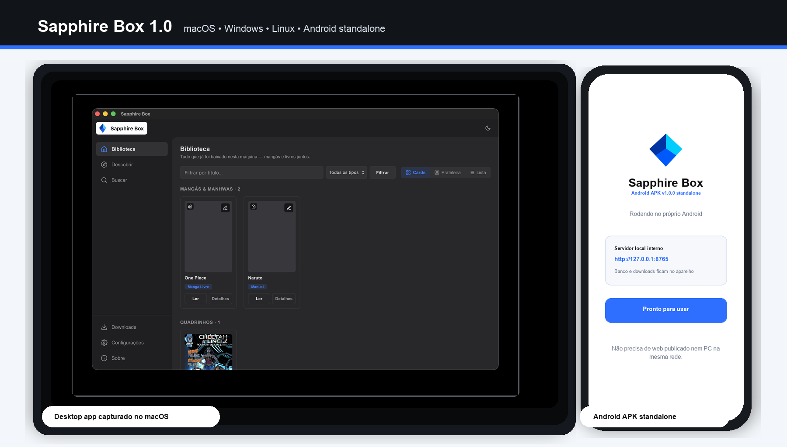
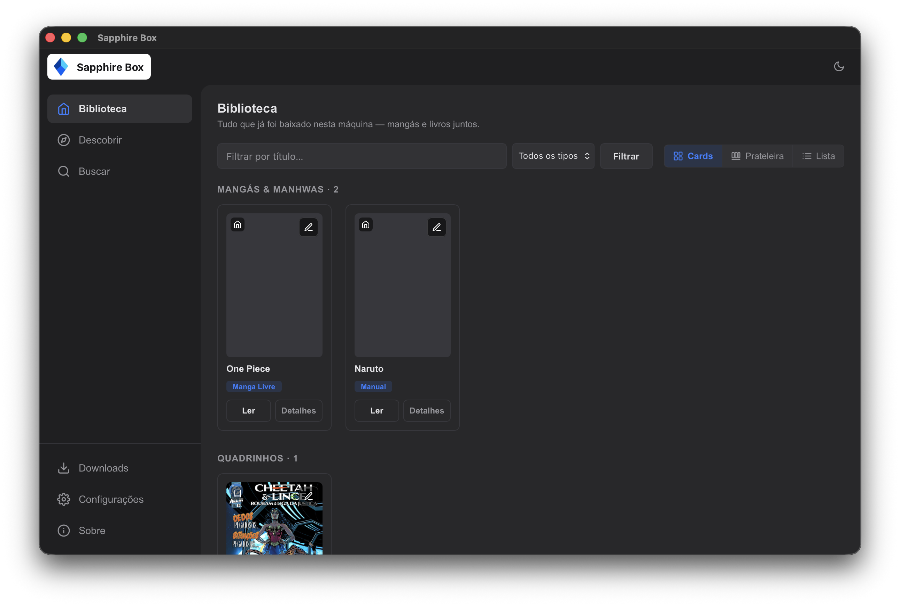

# Sapphire Box

<p align="center">
  
</p>

<h3 align="center">Biblioteca, scraper e leitor local para mangás, manhwas, livros e quadrinhos.</h3>

<p align="center">
  <a href="https://github.com/juankalleo/sapphire-box/releases/latest">
    
  </a>
  <a href="https://github.com/juankalleo/sapphire-box/releases/latest">
    
  </a>
  <a href=".github/workflows/ci.yml">
    
  </a>
  
</p>

<p align="center">
  <a href="https://github.com/juankalleo/sapphire-box/releases/latest">
    
  </a>
  <a href="https://github.com/juankalleo/sapphire-box/releases/latest">
    
  </a>
  <a href="https://github.com/juankalleo/sapphire-box/releases/latest">
    
  </a>
  <a href="https://github.com/juankalleo/sapphire-box/releases/latest">
    
  </a>
</p>

<p align="center">
  
</p>

## What It Does

Sapphire Box busca, baixa, organiza e lê conteúdo localmente. O núcleo é Python puro, com CLI, UI web empacotada e janela desktop via `pywebview`.

- Mangás/manhwas: MangaLivre e Niadd, com download em CBZ.
- Livros e quadrinhos: fontes implementadas como Baixe Livros, BDeBooks, LibGen, Zona Fantasma, Multiverso HQ, Gutenberg e Internet Archive.
- Biblioteca local: SQLite + pastas locais com leitura pelo próprio app.
- Desktop: macOS, Windows e Linux pelo mesmo código.
- Android 1.0: APK standalone com Python embutido, UI local e downloads no próprio aparelho.

## Downloads

| Platform | Download | Notes |
| --- | --- | --- |
| Android | [APK 1.0.0](https://github.com/juankalleo/sapphire-box/releases/latest) | Baixe `SapphireBox-Android-1.0.0.apk`. App standalone: não precisa de site publicado nem servidor no PC. |
| Windows | [EXE x64](https://github.com/juankalleo/sapphire-box/releases/latest) | Baixe `SapphireBox-Windows-x64.exe`. Binário portátil gerado por PyInstaller. |
| macOS | [Binary x64](https://github.com/juankalleo/sapphire-box/releases/latest) | Baixe `SapphireBox-macOS-x64`. Pode exigir liberar em Privacidade e Segurança na primeira abertura. |
| Linux | [Binary x64](https://github.com/juankalleo/sapphire-box/releases/latest) | Baixe `SapphireBox-Linux-x64` e marque como executável antes de abrir. |
| Python | [Wheel / source](https://github.com/juankalleo/sapphire-box/releases/latest) | Baixe `sapphirebox-1.0.0-py3-none-any.whl` ou o source package. |

## Install From Source

macOS/Linux:

```bash
git clone https://github.com/juankalleo/sapphire-box.git
cd sapphire-box
python3 -m venv .venv
source .venv/bin/activate
pip install -e .
```

Windows PowerShell:

```powershell
git clone https://github.com/juankalleo/sapphire-box.git
cd sapphire-box
py -3 -m venv .venv
.\.venv\Scripts\Activate.ps1
pip install -e .
```

## Quick Start

```bash
sapphirebox init
sapphirebox web
sapphirebox desktop
```

CLI guiada:

```bash
sapphirebox baixar
sapphirebox baixar "https://mangalivre.to/manga/one-piece/" -o ~/Downloads
sapphirebox wizard
```

Comandos diretos:

```bash
sapphirebox manga sources
sapphirebox manga search "one piece" -s mangalivre
sapphirebox manga download "<url do resultado>" -s mangalivre -c 1-3

sapphirebox books search "dom casmurro"
sapphirebox books download gutenberg-55752 -s gutenberg

sapphirebox library sync
sapphirebox library list
sapphirebox library books
```

## Android 1.0

O APK Android funciona sozinho. Ele embute o runtime Python via Chaquopy, inicia o servidor local dentro do próprio app e abre a mesma interface pelo WebView em `127.0.0.1`. Não precisa publicar o web, ligar um PC ou informar IP manualmente.

1. Baixe `SapphireBox-Android-1.0.0.apk` na release.
2. Instale no Android.
3. Abra o app e aguarde a inicialização local.
4. Use busca, leitura e downloads pelo próprio celular.

Os dados ficam no armazenamento interno do app Android. A permissão de internet é usada pelas fontes/scrapers.

## Desktop Releases

Os binários de Windows, macOS e Linux são gerados automaticamente pelo workflow de release. Para publicar uma nova versão:

```bash
git tag v1.0.0
git push origin v1.0.0
```

Também dá para rodar manualmente em **Actions > Release > Run workflow**.

Se os botões abrirem a release mas não aparecerem APK/EXE/binários, rode o workflow **Release** em Actions. A release só ganha esses arquivos depois que a Action termina e anexa os assets.

## Screenshots

| Desktop app | Android APK |
| --- | --- |
|  |  |

## Development

```bash
pip install -r requirements.txt
pytest
python -m build
```

CI roda testes e build em Linux, macOS e Windows. O release gera APK Android standalone, EXE Windows, binários macOS/Linux e o pacote Python.

## Status

Sapphire Box 1.0 entrega o núcleo funcional, CLI, desktop, UI web empacotada e APK Android standalone. As próximas frentes naturais são assinatura persistente de APK por secrets no GitHub Actions, teste em aparelho real a cada release e mais fontes com scraper próprio.
